# Fraudulent Transaction Detection

The problem is to identify fraudulent and non-fraudulent transactions from an **imbalanced dataset**, where fraudulent transactions are extremely rare yet critically important to identify.

Necessary steps were taken for data loading, visualization, preprocessing, model training and evaluation with gradual refinement.

Since the objective was to **_detect_** the fraud cases and not to **_cancel_** them, the columns (oldbalanceOrg, newbalanceOrig, oldbalanceDest, newbalanceDest ) were not dropped.

Training and evaluation was performed on LGBM and XGBoost models. For LGBM SMOTE was performed to upscale the minority cases. For XGB original data was used because scale_pos_weight internally compensates for the imbalance.

# Results

#### The user can select values from the dropdown and test.

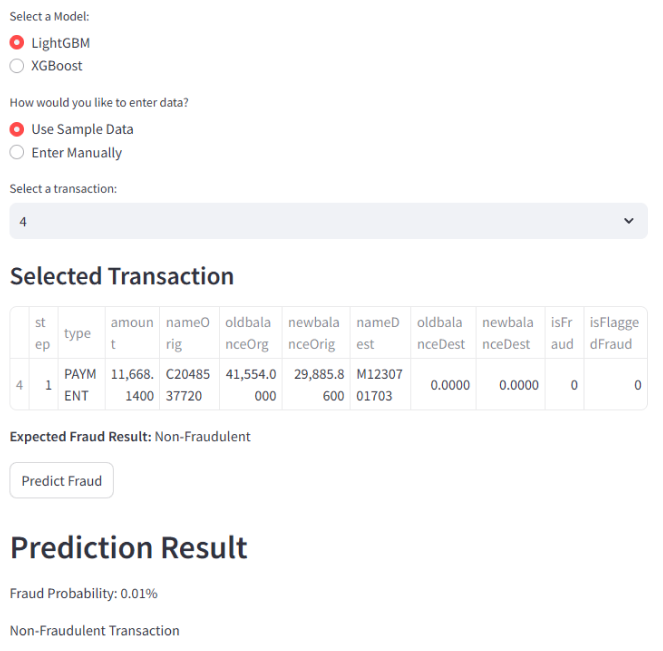
Let us take two cases from the dataset where **isfraud is true** and fraud must be detected
| index | step | type | amount | oldbalanceOrg | newbalanceOrig | oldbalanceDest | newbalanceDest | isFraud | isFlaggedFraud |
|---------|------|------|------------|---------------|----------------|----------------|----------------|---------|---------------|
| **3828476** | 282 | 4 | 481.90 | 481.90 | 0.00 | 0.0 | 0.00 | 1 | 0 |
| **178668** | 12 | 1 | 222048.71 | 0.00 | 0.00 | 2979.0 | 225027.71 | 1 | 0 | |

(Note: Where the label encoded values for **type** column are: {'CASH_IN': (0),
'CASH_OUT': (1),
'DEBIT': (2),
'PAYMENT': (3),
'TRANSFER': (4)})

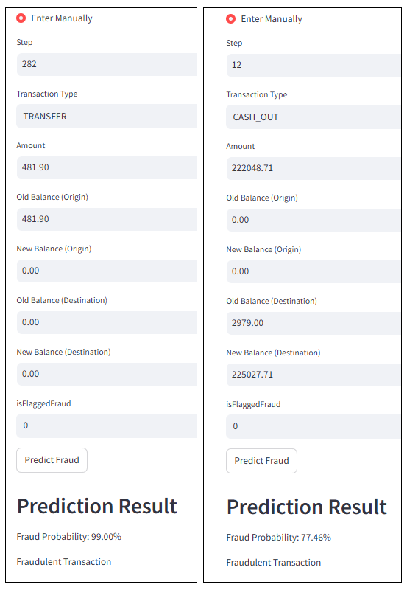

Fraud is successfully detected in both cases **for the default threshold**. The models have high recall but suffers with low precision which drastically reduces the F1-Score.
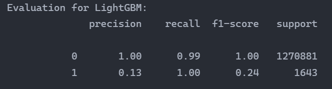
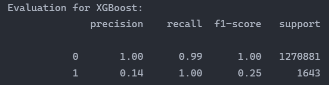

### So we adjust the threshold

We prevent **false positive alarms** at the cost of some **missed fraudulent transactions** to maintain the F1 Score.
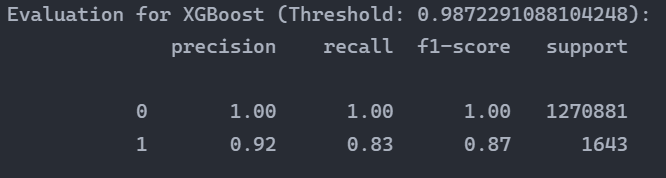
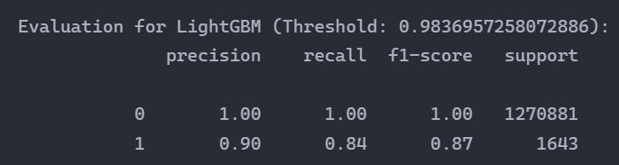

The value of threshold depends on the business requirements. For imbalanced dataset the value of accuracy is not meaningful so we rely on precision and recall.

# Other Observations

#### Dataset distribution Charts

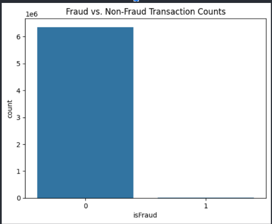
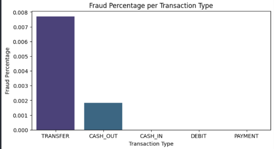

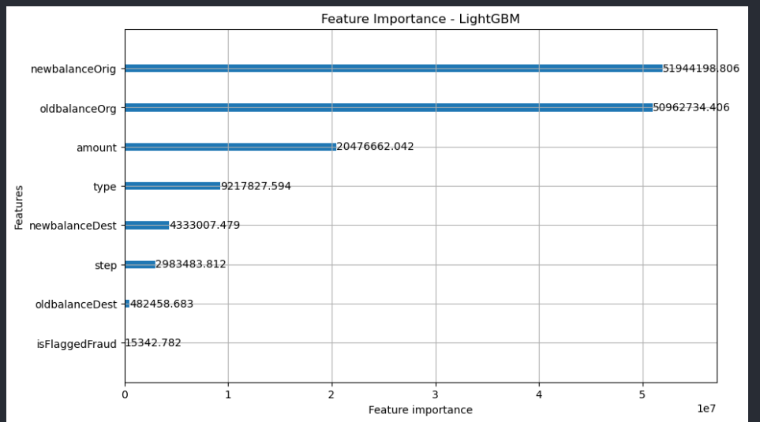
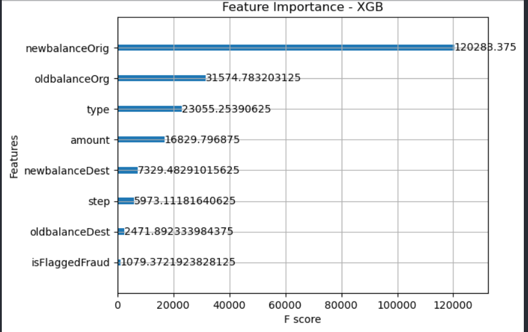
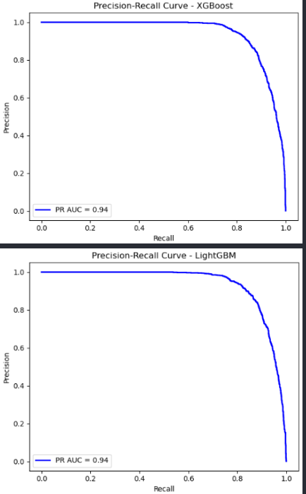
